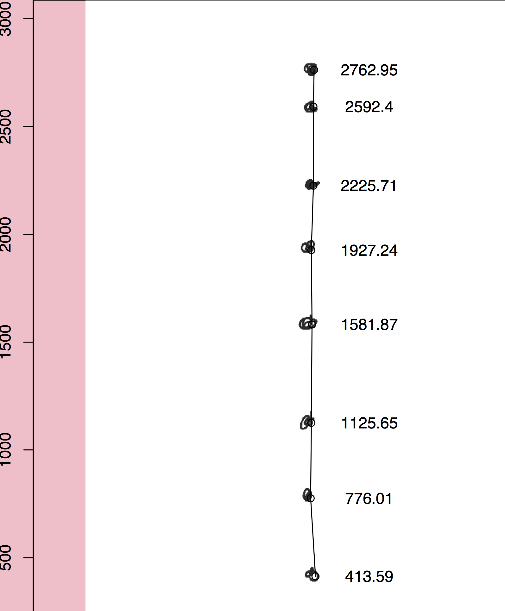

Particle Tracker
================
Marko Lipka
2/28/2018

Read and combine raster images and their exif data to track particle movement in liquids.

*exif* package is used to extract meta data.
image files are read and processed with the *raster* package.
particle movement can be tracked via selection of the particle positions in a stack of images via the *locator()* function.

Example
=======

``` r
source("ParticleTracker.R")
track.particles(
    path = "~/Dropbox/IOW/R-functions/Particle_locator/test/lala/lala/lulu/",
    sep.window = T, firstlast = F,
    exif.attribute = "origin_timestamp",
    #exif.attribute = NA,
    format = "jpg")
```



<table>
<colgroup>
<col width="36%" />
<col width="26%" />
<col width="9%" />
<col width="10%" />
<col width="8%" />
<col width="8%" />
</colgroup>
<thead>
<tr class="header">
<th align="center">filename</th>
<th align="center">timestamp</th>
<th align="center">width</th>
<th align="center">height</th>
<th align="center">x</th>
<th align="center">y</th>
</tr>
</thead>
<tbody>
<tr class="odd">
<td align="center">/FakeParticles3/2018-02-28 _ 5.10.19 PMparticle3.jpg</td>
<td align="center">1983-01-08 23:42:01</td>
<td align="center">2183</td>
<td align="center">3087</td>
<td align="center">1061</td>
<td align="center">2763</td>
</tr>
<tr class="even">
<td align="center">/FakeParticles3/2018-02-28 _ 5.10.20 PMparticle3 2.jpg</td>
<td align="center">1983-01-08 23:42:02</td>
<td align="center">2183</td>
<td align="center">3087</td>
<td align="center">1058</td>
<td align="center">2592</td>
</tr>
<tr class="odd">
<td align="center">/FakeParticles3/2018-02-28 _ 5.10.21 PMparticle3 3.jpg</td>
<td align="center">1983-01-08 23:42:03</td>
<td align="center">2183</td>
<td align="center">3087</td>
<td align="center">1058</td>
<td align="center">2226</td>
</tr>
<tr class="even">
<td align="center">/FakeParticles3/2018-02-28 _ 5.10.22 PMparticle3 4.jpg</td>
<td align="center">1983-01-08 23:42:04</td>
<td align="center">2183</td>
<td align="center">3087</td>
<td align="center">1048</td>
<td align="center">1927</td>
</tr>
<tr class="odd">
<td align="center">/FakeParticles3/2018-02-28 _ 5.10.23 PMparticle3 5.jpg</td>
<td align="center">1983-01-08 23:42:05</td>
<td align="center">2183</td>
<td align="center">3087</td>
<td align="center">1052</td>
<td align="center">1582</td>
</tr>
<tr class="even">
<td align="center">/FakeParticles3/2018-02-28 _ 5.10.24 PMparticle3 6.jpg</td>
<td align="center">1983-01-08 23:42:06</td>
<td align="center">2183</td>
<td align="center">3087</td>
<td align="center">1048</td>
<td align="center">1126</td>
</tr>
<tr class="odd">
<td align="center">/FakeParticles3/2018-02-28 _ 5.10.25 PMparticle3 7.jpg</td>
<td align="center">1983-01-08 23:42:07</td>
<td align="center">2183</td>
<td align="center">3087</td>
<td align="center">1045</td>
<td align="center">776</td>
</tr>
<tr class="even">
<td align="center">/FakeParticles3/2018-02-28 _ 5.10.26 PMparticle3 8.jpg</td>
<td align="center">1983-01-08 23:42:08</td>
<td align="center">2183</td>
<td align="center">3087</td>
<td align="center">1068</td>
<td align="center">413.6</td>
</tr>
</tbody>
</table>

<table style="width:54%;">
<colgroup>
<col width="41%" />
<col width="12%" />
</colgroup>
<thead>
<tr class="header">
<th align="left"> </th>
<th align="right">results</th>
</tr>
</thead>
<tbody>
<tr class="odd">
<td align="left"><strong>Travel time [s]</strong></td>
<td align="right">7</td>
</tr>
<tr class="even">
<td align="left"><strong>Travel distance [px]</strong></td>
<td align="right">2349</td>
</tr>
<tr class="odd">
<td align="left"><strong>Sinking velocity [px/s]</strong></td>
<td align="right">336</td>
</tr>
</tbody>
</table>
